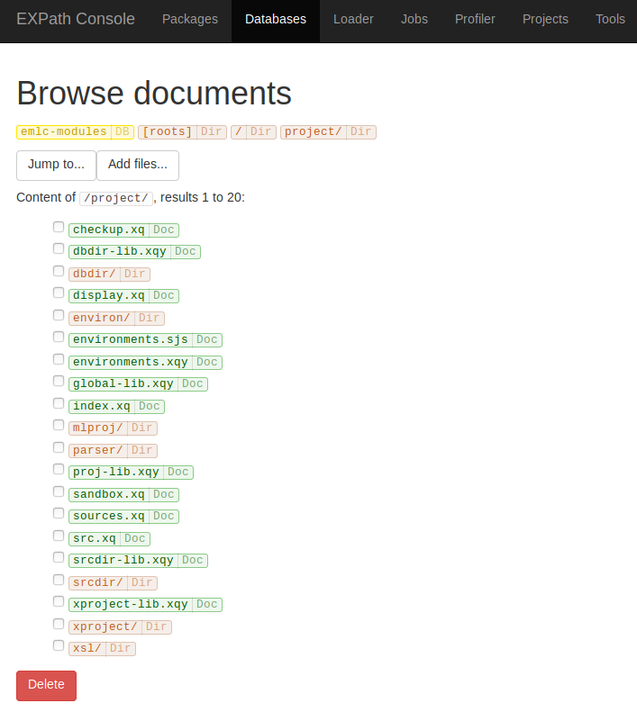
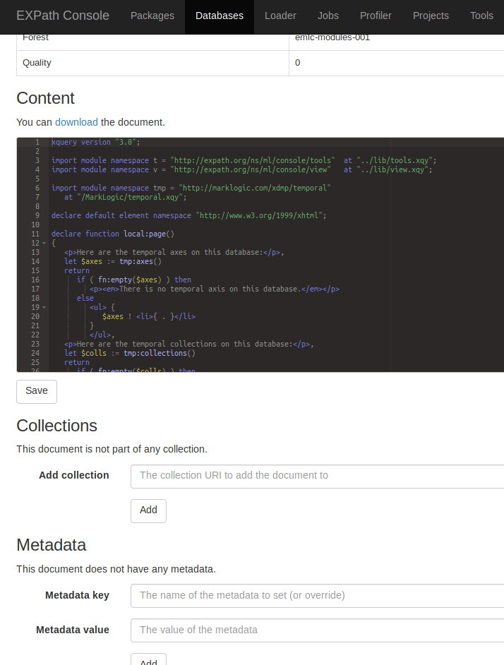
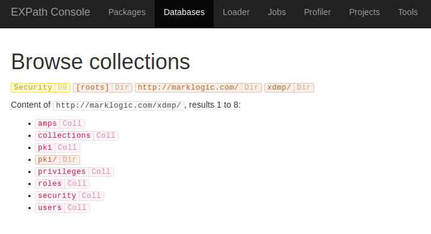
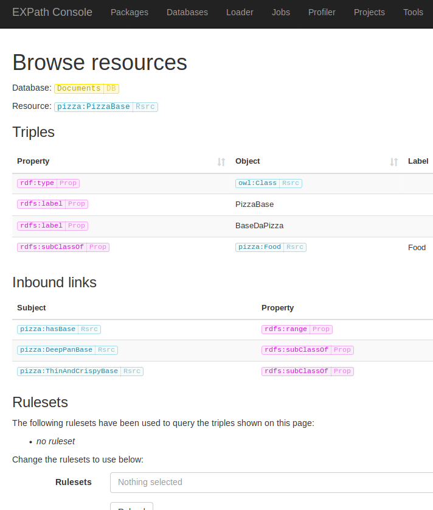

# Browser

The browser let you browse the content of a database.

Once you have selected a database to browse, you get a form with three options.
You can browse:

- [Documents](#documents)
- [Collections](#collections)
- [Triples](#triples)

Some aspects of the browser can be configured.  See the section [Config](../config/).

## Documents

The browser exposes the documents as if their URI were paths on a filesystem,
so you can browse in a directory-like way:

When you select a document, you can see alsmot all of the information about it
(including its content, syntax-highlighted):

You can also edit (or add/remove) the following properties:

- content
- collections
- metadata
- document properties
- permissions

The browsing entry points from the database page are:

- browse all "document directories" from the root
- go straight to a "document directory" by its path (must end with `/`)
- go straight to a document by URI

## Collections

You can also browse collections.  Their URIs are exposed in a similar way than
when browsing the documents by URI as if they were in directories.

When you select a collection though, it gives you the list of all the documents
part of that collection.

The browsing entry points from the database page are:

- browse all "collection directories" from the root
- go straight to a "collection directory" by its path (must end with `/`)
- go straight to a collection by URI

## Triples

You can also browse triples.  Whether they are managed, non-managed, or exposed
directly through TDE templates does not matter:

For one specific resource, it shows:

- all triples with that IRI as a subject
- all triples with that IRI as an object (the "inbound links")
- the URI of all the documents containing these triples (very useful for
  unmanaged triples)

You can also choose the rulesets to use, in order to display the triples
generated by these rulesets as well.

Of course, you can click on any IRI in order to display its own triples and
inbound links.  That is, browse the triple graph.

The "shortening" of the full IRI to human-friendly CURIE using a prefix
(e.g. `foo:bar` instead of `http://example.org/ontology/foo#bar`) is controlled
by the database configuration.  See [Config](config).

The browsing entry points from the database page are:

- browse all triples
- go straight to a resource by IRI
- go straight to a resource by CURIE
