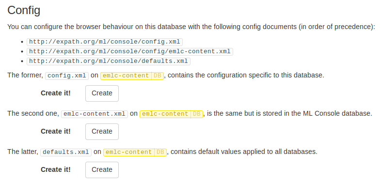

# Configuration

The ML Console can be configured by providing values for some config components,
stored in documents with specific URI.

- [Location](#location)
- [Format](#format)
    - [Triple prefixes](#triple-prefixes)
    - [URI schemes](#uri-schemes)
    - [Default rulesets](#default-rulesets)
- [Resolving components](#resolving-components)

Configuration is achieved by providing config components.  Most components can
affect the entire Console as well as being restricted to a specific database.
Controlling the scope of config components is done by using different config
documents, in different locations.

## Location

The config documents are simple XML documents.  They are stored in specific
locations, as the form to create them explains (at the bottom of the database
browser screen):

There are three locations where we can have configuration for a specific
database:

- `http://expath.org/ml/console/config.xml` (on the database it configures)
- `http://expath.org/ml/console/config/{db}.xml`
- `http://expath.org/ml/console/defaults.xml`

Let's say we look at the `Document` database.  The first location that the
Console looks at for config is `http://expath.org/ml/console/config.xml`, on the
`Documents` database itself.

Then it looks at `http://expath.org/ml/console/config/Documents.xml` (with the
name of the database part of the URI), but this time on the ML Console database
itself.  That is, the database attached as the content database on the Console
app server.  The main advantage is that the document does not interfere with
your data, and you don't have to insert it again and again when wiping your
content database, if this is part of your dev process.

Finally, the Console looks at `http://expath.org/ml/console/defaults.xml`, also
on the ML Console own database.  The config in that document is applied to all
databases.  This is in case you want to share config for all your databases
(e.g. triple prefixes, which are usually quite standard.)

## Format

All the configuration documents share the same format.  The overall format is as
following:

    <config xmlns="http://expath.org/ns/ml/console">
       <uri-schemes>
          ...
       </uri-schemes>
       <triple-prefixes>
          ...
       </triple-prefixes>
       <default-rulesets>
          ...
       </default-rulesets>
    </config>

See the following sections for details on the format of each of these elements
(uri schemes, triple prefixes and default rulesets.)

When you use the above form to create such a config doc, it contains an empty
configuration, incuding a comment containing an example of each element.

So usually you just create the config doc in the interface, then copy and paste
and adapt parts of it in place, in the document editor.  When you are happy with
a config doc, you can download it and add it to your codebase, to be deployed
with the rest of your documents or code, if you want to.

### Triple prefixes

List of additional triple prefixes to use in the triple browser:

    <triple-prefixes>
       <decl>
          <prefix>foaf</prefix>
          <uri>http://xmlns.com/foaf/0.1/</uri>
       </decl>
       <decl>
          <prefix>prov</prefix>
          <uri>http://www.w3.org/ns/prov#</uri>
       </decl>
    </triple-prefixes>

Each `decl` element is a pair prefix/URI.  The second one above has the same
semantics as the following prefix declaration in SPARQL:

    PREFIX prov: <http://www.w3.org/ns/prov#>

It is used by the triple browser to display IRI in a human-friendly way, using
the CURIE notation.  You can then also use CURIE to search for a specific
resource.  For instance, with the above mapping, the CURIE `prov:Entity` stands
for the following IRI:

    http://www.w3.org/ns/prov#Entity

### URI schemes

Documents are browsed based on their URI, as if they were hierarchical, like
paths for directories and files in a file system.  URI schemes configure how to
present the URIs in a tree model.

    <uri-schemes>
       <scheme sep="/">
          <root>
             <fixed>/</fixed>
          </root>
          <regex>/.*</regex>
       </scheme>
       <scheme sep="/">
          <root>
             <start>http://</start>
          </root>
          <regex match="1">(http://[^/]+/).*</regex>
       </scheme>
    </uri-schemes>

First you have to define the separator between the different parts of the paths.
The most common separtor is `/`, but you can have `:` for instance in URNs.  Or
any other separator you want.

Then you define the "roots" of the hierarchy.  Either fixed, like `/` in
`/foo/bar.xml`, or starting with a fixed string, like `http://` in
`http://example.org/foo/bar.xml`.  Note that in the latter, the root is
`http://example.org/` (with a "directory" `foo`, and the "file" `bar.xml`.)

Finally, the `regex` is the regular expression matching an entire URI for this
URI scheme to be applicable.  In case of a scheme with roots defined by a
`start`, the regular expression must set a matching group (identified with
parenthesis) to the value of the root.  In the example above for `http://` URIs,
the matching group `1` is set to be the root.

### Default rulesets

Rulesets are used to enrich the dataset for SPARQL queries using rules.  If you
need them, you must already know what they are.

    <default-rulesets>
       <ruleset>domain.rules</ruleset>
       <ruleset>range.rules</ruleset>
    </default-rulesets>

This element simply lists all the rulesets to be used by default when evaluating
SPARQL queries in the triple browser.  This can enrich the set of triples
associated to a resource IRI.  MarkLogic provides a set of builtin rulesets to
use with ontologies, see the official documentation for more information.

## Resolving components

Components are each of the individual config elements.  For instance, the
`triple-prefixes` contains zero or several components, each materialized by a
`decl` element.  The several config documents are merged to provide the set of
applicable config component.

Given a specific database, called `{db}`, the following config documents can
contribute to the set of config components:

- `http://expath.org/ml/console/config.xml` (stored on `{db}` itself)
- `http://expath.org/ml/console/config/{db}.xml`
- `http://expath.org/ml/console/defaults.xml`

Components in the first document in this list have precendence over the other
documents, and the second one over the last one.

By default, all components in these documents are added to the final list of
components, with the first matching component winning (in the above config
document order.)

You can use the attribute `@delegate` on a group of components (e.g. on the
element `triple-prefixes`) to control the way components are merged into the
final list.  The possible values are:

- `true` (or `after`, the default) - components in subsequent docs are added
  after
- `false` (or `never`) - other subsequent docs are not considered
- `before` - components in subsequent docs are added before

For instance:

    <!-- http://expath.org/ml/console/config/Documents.xml -->
    <config xmlns="http://expath.org/ns/ml/console">
       <triple-prefixes delegate="before">
          <decl>
             <prefix>foo</prefix>
             <uri>http://first.org/foo#</uri>
          </decl>
       </triple-prefixes>
    </config>

    <!-- http://expath.org/ml/console/defaults.xml -->
    <config xmlns="http://expath.org/ns/ml/console">
       <triple-prefixes>
          <decl>
             <prefix>foo</prefix>
             <uri>http://second.org/foo#</uri>
          </decl>
          <decl>
             <prefix>bar</prefix>
             <uri>http://second.org/bar#</uri>
          </decl>
       </triple-prefixes>
    </config>

By default, the global list of triple prefix declarations would be:

    foo -> http://first.org/foo#
    foo -> http://second.org/foo#
    bar -> http://second.org/bar#

But because it actually delegates **before**, it is rather (see, the first `foo`
in the list is now different):

    foo -> http://second.org/foo#
    bar -> http://second.org/bar#
    foo -> http://first.org/foo#

If `@delegate` was `never`, the list would rather be (there is no `bar` to be
found anymore):

    foo -> http://first.org/foo#
