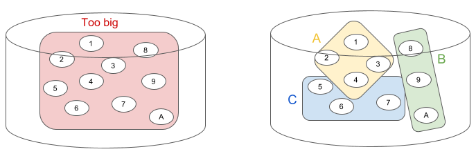

# Jobs

Jobs let you execute processing that would not necessarily fit in one single
transaction, by splitting it into smaller tasks, executed in sequence.

- [Structure](#structure)
- [Details](#details)

A job represents the entire processing you want to achieve, whilst its tasks are
each one a smaller piece of that larger processing.

A typical example is when you want to modify all documents in a given
collection, or even in the entire database.  For instance due to a change in the
data model.

If the collection contains a large number of documents, maybe a significant
portion of the entire database, then it is not possible to modify all of them in
one single transaction.  If you compute first a list of groups of say, 1,000
document URIs, then you can process the first group of 1,000 documents, then the
next one, then each of them in sequence.

## Structure

A job is the definition containing what to do, and how to do it.  You can start
a job, or "instantiate" it, creating an activity.  The activity represents just
one run of a job.  One job can be run several times.  Each piece of processing
executed in an activity is a task.

## Details

In order to better understand jobs and tasks, it is useful to understand why we
need them at all, when to use them, and how they are implemented.

### Why

A query (an entire XQuery or JavaScript) is executed in the scope of a
transaction.  A transaction records all changes made to databases: new
documents, updates, deletions, every modification.  Only when the query
completes successfully, the transaction is "committed" (the changes are actually
written to the database).  If the query fails (e.g. if an error is thrown and
never caught), the transaction is "rollbacked" (the changes are discarded).
This is the only way to avoid data corruption (all changes made in a single
query are either all committed, or all rolledback, at once).

If the query takes too much time or makes too many changes, it might be too big
too fit in a single transaction.  MarkLogic simply "kills" (and rollback) a
query that takes too long or when the changes are too large to keep track of.

Also, if a query makes changes to a whole lot of documents, we do not want
necessarily for the entire transaction to be rolledback in case of an error on
one single document.

For some maintenance tasks, it is useful then to use a divide and conquer
approach: first divide the entire set of changes to apply in smaller chunks,
then apply the query to each of these chunks in a separate transaction.

A typical example is a change in the data model that requires to update all
documents in the database (or a significant part of them).  If the database is
large enough, the query is likely to make too many changes to fit in one single
transaction.  In that case, you can rather define chunks of say, 1,000 document
URIs, then execute the query that modifies a set of documents once for each
chunk.

### When

TODO: Still to be written...

### How

MarkLogic provides a special app server on every cluster (technically, on each
group on the cluster).  The task server is basically a queue of the queries that
have been "spawned" (scheduled to be executed asynchronously, in their own
transaction).  The task server is a powerful tool, but it comes with its own
complexity, especially the complexity inherent to dealing with asynchronous
processing.

The ML Console provides a layer on top of the task server.  It let you provide 2
queries (one to identify the chunks of data to work on, and the second to
actually work on each of them).  Once a job is defined, you can then excute it.
A job can be executed several times (e.g. a maintenance job to be executed on a
regular basis).

It takes care of saving the chunks, starting a new task for each of them, makes
sure the tasks are executed in sequence, and tracks the status of each task, and
records the result or error for each task.

The ML Console also provides a handy web UI to define, execute, and monitor
jobs.
